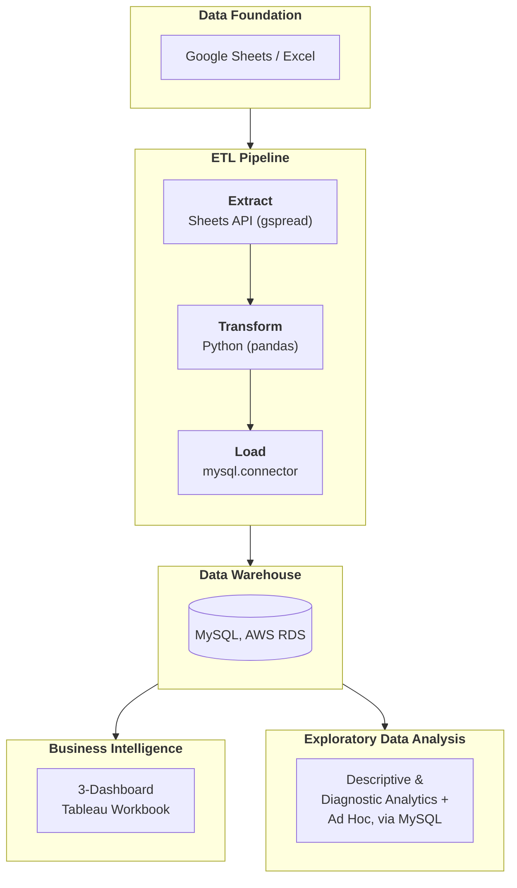

<h1 align="left">Lakshira Handwoven Weaves: Data & Systems Build</h1>

An end-to-end data and systems engagement for a real small business: a handloom textile brand with no data infrastructure, rapid organic growth it couldn't measure, and an ambition to reach luxury-boutique scale. This repo documents the full build, stage by stage: from the discovery work that scoped the problem through the operational system now running the business day to day.

My approach stays the same regardless of stage: understand the business and the question before touching a tool. Discovery came first specifically to surface the pressure points already hampering the business, and every stage since has been built on what the one before it established, in order, not in parallel. But it isn't a one-shot pipeline. Day-to-day use of **Business Intelligence** and **Operational System** continues to surface new data needs, which loop back into **Data Foundation** and flow forward again.

<h2 align="left">Repository Structure</h2>

| | |
|---|---|
| **`docs/`** | The write-ups and diagrams: how the system works, how its requirements were gathered, and the schema it's built on |
| **`inventory_management_system/`** | The system itself: its code, the fonts and logo used in generated reports, and a settings template |
| **`tests/`** | 205 automated checks that confirm the system still works correctly every time something changes |
| **`requirements.txt`** | The list of external tools the system needs installed to run |
| **`pytest.ini`** | Configuration for running the automated tests |
| **`.gitignore`** | Tells Git which files, like passwords and credentials, should never be uploaded |

<h2 align="left">Stages</h2>

<h3 align="left">1. Discovery & Requirements</h3>

Before any recommendation was made, a structured stakeholder discovery and requirements-gathering session mapped how the business actually operated: a single combined session covering current-state workflow, pain points, customers, suppliers, financials, growth goals, and current data and tools, appropriate to a one-person engagement with a single decision-maker. That was then followed by a formal audit of the data behind the business's rapid growth, which surfaced the core problem. The business had grown faster than its own ability to track and understand itself, and that gap, not a lack of tooling, was the actual ceiling on its growth.

| | |
|---|---|
| **Method** | 7-section discovery and requirements session, run as a conversation, not a script |
| **Scope** | 45 questions across current-state workflow, pain points, customers, suppliers, financials, growth goals, and current data and tools |
| **Audit** | A formal data-quality audit logging 44 specific pre-existing issues, including duplicate SKUs and missing cost/pricing data, before a line of the new system was built |
| **Output** | Findings that directly shaped the data model, the analytics built, and the 10 operations scoped into **Operational System** |
| **Impact** | Self-reported inventory count was found to understate actual holdings by roughly half once every source was located |

[Interview Framework](docs/STAKEHOLDER_DISCOVERY.md)

<h3 align="left">2. Data Foundation</h3>

Inventory tracking was dispersed across 12 separate spreadsheets with no single source of truth, no standardized categories, weave types, or suppliers, and no consistent pricing method. The first build stage replaced that entirely with a unified master sheet: standardized category and supplier reference tables, data validation across every controlled field, conditional formatting that flags unit- and business-level health metrics, and formula-driven derived columns. Where there was once a scattered manual tracking system for the business's lifetime units, there now was a real data model, the single source of truth for any question the business had.

| | |
|---|---|
| **Before** | 12 fragmented spreadsheets, no standardized categories, weave types, suppliers, or pricing method |
| **Built** | One unified master sheet with standardized reference tables, data validation, conditional formatting, and formula-driven fields |
| **Documentation** | A full data dictionary and category/supplier reference tables, produced as standalone artifacts |
| **Impact** | Manual pricing, tested under direct supervision, contained a calculation error roughly 7 times out of 10; corrected pricing recovered several thousand dollars in inventory that had been priced below its own cost |

<h3 align="left">3. Data Warehouse</h3>

A unified master sheet centralized the data needed to assess the business's health, but it still couldn't support Exploratory Data Analysis (descriptive and diagnostic analytics, run as one-off queries rather than scheduled reports) at scale, so a Python ETL pipeline extracts data from the master sheet via the Sheets API, transforms it with pandas, and loads it into a normalized MySQL schema hosted on AWS RDS (Relational Database Service). The business's live operational data became queryable for analysis the sheet alone couldn't support.

| | |
|---|---|
| **Pipeline** | Extract (Google Sheets API) → Transform (pandas) → Load (MySQL on AWS RDS) |
| **Schema** | 5 normalized tables: category, customer, inventory, supplier, transaction |
| **Scale** | 1,495 inventory records · 494 transactions · 61 customers · 18 suppliers |
| **Status** | Built and running; ETL codebase not yet published as a separate repo |
| **Impact** | Exploratory Data Analysis, e.g. supplier profitability or cash tied up in aging stock, that once took hours of manual spreadsheet review is now done in seconds |

*The pipeline runs on an automated daily schedule via cron; Tableau is refreshed from periodic MySQL exports rather than a live connection.*

*Note: the schema was designed with a full Entity-Relationship Diagram (ERD) before a line of the pipeline was written, not reverse-engineered from the code after the fact.*

[View the ERD](docs/erd.png)

<h3 align="left">4. Business Intelligence & Analytics</h3>

Once the warehouse was built and a string of descriptive and diagnostic queries had been run against it, it became clear which north-star KPIs and visualizations needed a permanent home to give the owner visibility she never had. A 3-Dashboard Tableau Workbook was built to cover three core areas of the business: Business Overview, Inventory & Operations, and Customer Intelligence. The same retail-specific analytical frameworks feed both the Tableau layer and dedicated tabs on the production sheet, so the insight isn't locked behind one tool.

| | |
|---|---|
| **Dashboards** | Business Overview · Inventory & Operations · Customer Intelligence |
| **Analytics** | Sell-through rate, dead stock/markdown, inventory health & turnover, supplier performance, pricing effectiveness, margin-bucket distribution |
| **Status** | Built and in use; not published publicly, since it surfaces real business figures |
| **Impact** | Visibility into inventory-aging risk directly changed intake behavior; the following month became the business's best on record |

<h3 align="left">5. Operational System</h3>

The data and analytics foundation still left a gap. The owner was already juggling supplier relationships, sales, marketing, advertising, and building her own storefront from scratch, and running the business day to day meant risking the kind of mistakes that compound downstream. The final stage scopes the business down to its 10 most-used operations and replaces manual spreadsheet editing with a guided CLI that catches errors before they happen and automates the calculations most prone to mistakes, without ever standing in for her judgment.

| | |
|---|---|
| **Operations** | 10, covering the full inventory-to-sale-to-reporting lifecycle |
| **Quality assurance** | 355 defects resolved (23 Critical) via structured UAT, backed by a 205-test automated regression suite |
| **Built with** | Python, in collaboration with Claude Code |
| **Impact** | Removed day-to-day reliance on manual analyst involvement for pricing and discount decisions, replacing ad hoc requests with self-serve tools grounded in real margin thresholds |

[IMS](docs/IMS.md) **·** [Architecture](docs/ARCHITECTURE.md)

---

*Note: real customer, supplier, and financial data are not included anywhere in this repo, and specific business findings and figures from the engagement are documented in a private report for the client instead of published here, standard confidentiality practice for a real, operating business, not a reflection on the work or its results. Figures above are either aggregate counts (record/table counts) or reference values seeded with placeholder data of the same shape as production.*
