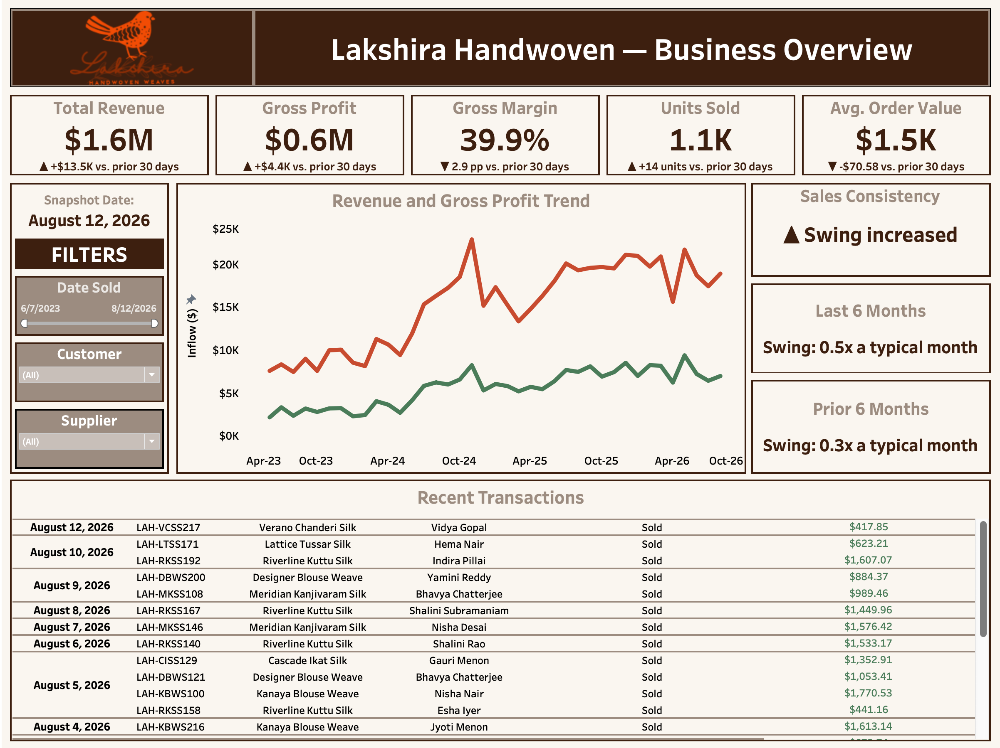
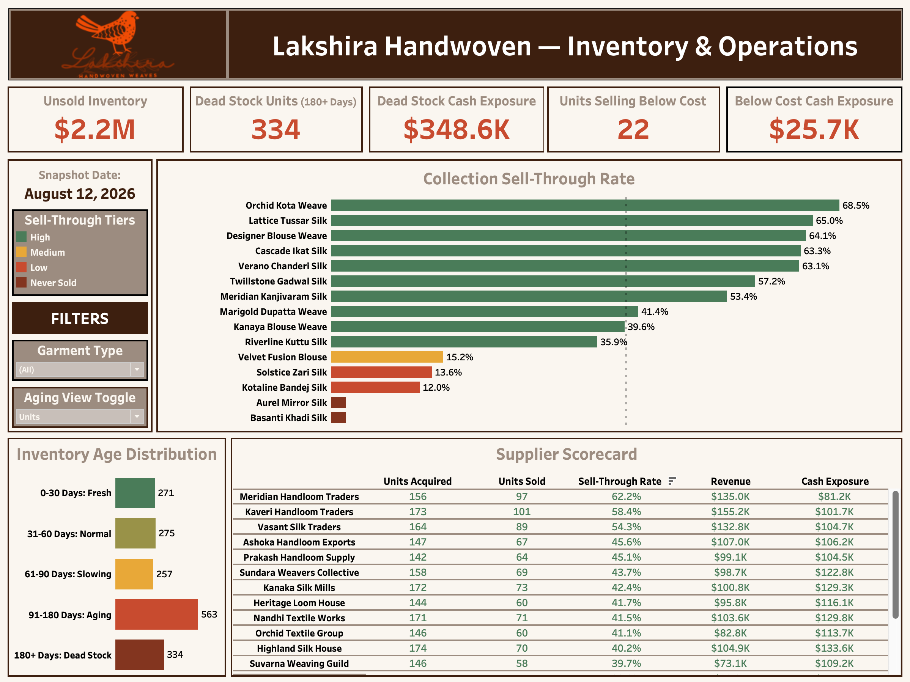
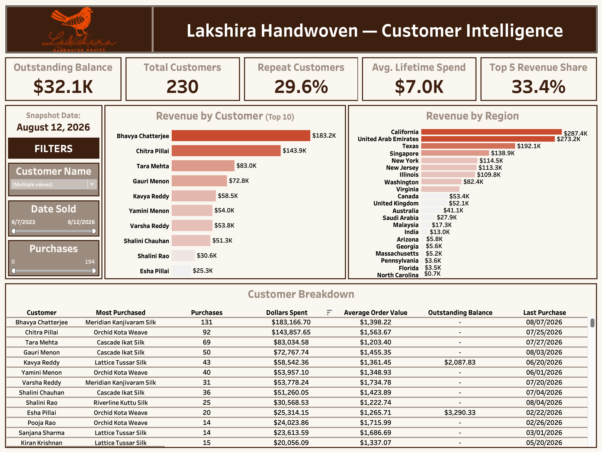

<h1 align="center">Lakshira's Business Intelligence Layer</h1>

*Part of the [Lakshira engagement](../README.md). This is the deep dive on the Business Intelligence stage specifically; refer to the main README for the full lifecycle: discovery, data foundation, warehouse, this stage, and the operational system.*

The Business Intelligence (BI) layer is a 3-View Tableau Workbook built on top of the MySQL warehouse: Business Overview, Inventory & Operations, and Customer Intelligence. This document covers the design reasoning behind it, not just what it shows: why a dashboard was needed at all once an operational system already existed, why three views instead of one, and how filters and dimensions are used deliberately rather than added for their own sake.

The dashboard design below, every KPI, calculation, chart, and filter, is identical to what the client uses in her own weekly workflow. Only the data differs: these screenshots come from a sanitized, fully synthetic version of the workbook, so no real customer, supplier, or financial figures appear anywhere in this repo. See [Business Intelligence Architecture](BUSINESS_INTELLIGENCE_ARCHITECTURE.md) for how that synthetic dataset was built.

## 1. Why This Exists

Before this engagement began, questions about the business were answered from memory and intuition rather than data, because there was no reliable or structured way to answer them otherwise.

The data model built earlier in this engagement served as a centralized, structured foundation for the business's data, replacing scattered spreadsheets with one ordered system. It made the business queryable, but only for someone who could write a query, not the owner herself. A centralized system alone didn't solve entry, either: a staging schema gave a chance to check the client's inputs before transferring them into the master sheet, it was never meant to prevent mistakes outright. Without real-time validation, that check became a loop: review the entries, flag anything wrong and send it back, wait for the correction, then finally transfer once everything was right. That's why the [Inventory Management System](IMS.md) exists: ten operations covering the business's core functions, including a Generate Report operation that goes well beyond aggregation: an executive summary, targeted recommendations, and footnoted explanations of why a number moved the way it did, all grounded in the business's actual brand context and stakeholder findings, not generic industry benchmarks. She can generate it independently, on her own schedule, identifying exactly what needs attention before ever involving an analyst. Likewise, an analyst can generate the same report to prepare for a session with her, arriving with specific areas of growth and pain points already identified rather than spending that time gathering information.

However, a real gap still remained. The report generator only runs on fixed periods (monthly, quarterly, annually, or a custom date range), and being text-heavy, insight can easily get buried in a field of text rather than surfaced at a glance. The deeper problem is cadence, how often the report actually runs: at quarterly or annual scale, the owner would naturally expect to see larger swings, so a genuinely bad month hiding inside an otherwise-strong quarter wouldn't get the attention it deserved until the report caught up to it, by which point weeks of missed correction had already happened. For a business like Lakshira's, aspiring to reach luxury boutique status, a bad week or month needs to surface in real time, not get read about three months later.

The dashboard exists specifically to close that timing gap: built for a weekly or monthly refresh rather than quarterly or annually, scoped to convey the health of the business and its operations through Key Performance Indicators (KPIs) and visual charts instead of text-heavy formats. Filters placed across each view allow the user to slice the data themselves, defining the level of granularity appropriate to making informed business decisions, rather than waiting on a fixed report period. It's a faster feedback loop, providing direction on where to take action next, even while skimming.

## 2. Why Three Views, Not One

The first instinct was a single view. But that idea didn't hold up against the most important lesson learned delivering Business Intelligence work: a dashboard crowded with every chart type available, filter-heavy, and missing a focused color palette to direct attention to what actually matters isn't more informative, it's messier. A good dashboard is simple, scoped tightly to what the business and the client actually need, and interactive enough that even the least technical user can find their way around it without exhaustive onboarding.

The three views map directly onto three distinct questions the business needed answered, not an arbitrary split:

| View | Question it answers |
|---|---|
| **Business Overview** | How is the business doing, and where is it trending? |
| **Inventory & Operations** | What's hampering the business, and where is capital tied up or at risk? |
| **Customer Intelligence** | Who are the customers keeping this business running? |

A single combined view would have forced incompatible granularities onto the same page, lifetime health metrics next to individual aging units next to per-customer detail, making it difficult to protect the one thing that matters most on a KPI: a lifetime number that reflects lifetime truth regardless of whatever a viewer happens to be filtering elsewhere on the page (more on that in §4). Answering a different question per view, each complementary to the others, let every view freely define its own filters and level of detail, avoiding that collision entirely.

## 3. Filters and Dimensions as a Design Principle

The report generator's fixed periods meant the client could never see how the data responded as she got more or less granular; every report was locked to whatever period was requested. The dashboard is built around the opposite idea: empower the user by placing the granularity control in their hands, and let them explore at their own pace instead of waiting for a scheduled report. That matters even more given how many fronts the client juggles day to day: something she notices in her own numbers might surface a pattern that an analyst, without that same ground-level visibility, could easily miss.

This isn't interactivity for its own sake. A concrete example: within Customer Intelligence, Revenue by Region does more than show which regions and countries matter most to the business's health. Because Lakshira also prides itself on cultivating relationships in person, building the brand's presence through in-person pop-ups and exhibitions, the chart becomes a planning tool: it shows where online revenue has grown enough to justify the cost of a physical presence, a pop-up or exhibition where customers can shop in person.

That said, not every object on the dashboard should respond to a filter. The KPI cards at the top of each view exist to answer a single question: how is the business doing? If those numbers shifted with whatever a viewer happened to have filtered elsewhere on the page, they'd stop serving as a stable, trustworthy baseline, the one thing they're meant to protect. So the dashboard draws a deliberate line: headline KPIs stay immune to ordinary filters, while the supporting charts and tables beneath them — Revenue by Customer, the Collection Sell-Through chart, the Recent Transactions table — are explorable and filter-responsive, because their job is to let a user drill in. The rule of thumb: filters belong wherever exploration adds value, and are deliberately excluded wherever they'd compromise a KPI meant to hold one fixed, reliable value no matter what else is filtered on the page.

## 4. The Three Views in Detail

### 4.1 Business Overview

This view establishes lifetime health first, then asks whether the business is currently trending in the right direction. Five headline KPIs, Total Revenue, Gross Profit, Gross Margin, Units Sold, and Average Order Value, each report a lifetime total alongside a delta badge comparing the current 30-day window against the prior 30-day window. The delta is the more actionable number: it tells her whether recent conditions are moving up or down so she can start investigating the cause while it's still recent, rather than discovering a decline months later in a scheduled report. The Revenue and Gross Profit Trend chart underneath complements that same delta by showing the shape of the whole trajectory, not just a two-point comparison.

Two supplementary objects add depth without diluting the headline row. **Sales Consistency** answers a question a simple revenue trend can't: not just "is revenue up or down," but "how erratic is it." It compares the swing between a period's best and worst month, relative to a typical month, across the last six months against the prior six, a genuinely custom metric built specifically because volatility itself is information a business owner needs, a business that swings wildly month to month carries a different kind of risk than one growing steadily, even at the same average growth rate. **Recent Transactions** is a rolling 30-day window of individual closed sales, giving her a ground-level view underneath the aggregate KPIs.

### 4.2 Inventory & Operations

Business Overview measures health; this view identifies what's actively hampering it. Five KPIs, framed around capital at risk rather than abstract inventory statistics: Unsold Inventory (capital currently tied up in stock that hasn't sold), Dead Stock Units and their Cash Exposure (units aged 180+ days without moving, the more painful inflection point since these are functionally stuck), and Units Selling Below Cost with their Cash Exposure (units priced under what they cost to acquire, a real loss if sold at that price, not just a smaller profit).

Two charts extend the reasoning. Given the business carries dozens of distinct weave-type collections, **Collection Sell-Through Rate** identifies which are actually moving, informing future intake: allocate more toward what's selling, less toward what isn't, rather than reordering by habit. **Inventory Age Distribution** breaks down how long available units have been sitting, weighted toward flagging the 91-180 day and 180+ day buckets specifically, since with 1,000+ units in inventory at any given time, and that number only growing as the business scales, knowing where the aging risk is concentrated matters more than knowing the total count alone. The **Supplier Scorecard** closes the view by identifying which suppliers the business buys most from and which suppliers' units customers actually buy, information she needs to cultivate the right relationships as sourcing scales with the business.

### 4.3 Customer Intelligence

Before this engagement, no customer information was captured at all, sales went to whoever was buying, with no record of who they were. That's a real gap: a business is built on its most loyal customers, in the same way supplier relationships need active cultivation, customer relationships do too, and repeat customers are what keep a business afloat during a slow stretch for new customer acquisition.

The five KPIs are framed as ready-reference answers to the questions that actually matter for prioritization: how much is still owed on sold units, how many total customers exist, what share are repeat buyers, what does the average customer spend, and how much of lifetime revenue comes from the top 5. Together they tell her who to prioritize, support forecasting, and give her a concrete starting point for converting one-time buyers into repeat ones. **Revenue by Customer** breaks down exactly how much her top 10 have contributed. **Revenue by Region** supports the international and exhibition-planning use case described in §3. The **Customer Breakdown** table is the full detail underneath all of it: every customer who's ever purchased, their preferred collection, purchase count, dollars spent, average order value, any outstanding balance, and their last purchase date, specifically so the owner has a concrete, evidence-based reason to reach back out if it's been too long.

### Design language

Every tooltip across all three views follows the same rule: it earns its place only by adding information that isn't already visible elsewhere on the card or chart. A KPI card's tooltip never restates the number already shown in large text above it; instead it breaks that number into its current/prior components, or explains a term that isn't self-evident (Gross Margin, Accounts Receivable). A chart's tooltip surfaces whatever the visual encoding *can't* show, a bar's exact underlying count behind a percentage, a supplier's performance relative to the overall average, not a repeat of the axis label sitting right next to it.

Color follows a similarly deliberate rule: green means healthy, gold means caution, red-orange through dark maroon means risk, and that mapping is held constant across every KPI card, chart tier, and table on the dashboard, not reinvented per visualization. A viewer who learns the color language once on Inventory & Operations can carry that same reading straight into the Supplier Scorecard or the Inventory Age Distribution chart without relearning it.

---

For how the underlying data source is structured, how every figure on this dashboard is independently verified, and how the sanitized demo's synthetic dataset was built to read as genuine, see [Business Intelligence Architecture](BUSINESS_INTELLIGENCE_ARCHITECTURE.md).

*Note: real customer, supplier, and financial data are not included anywhere in this repo. Specific business findings and figures from the engagement are documented in a private report for the client instead, standard confidentiality practice for an operating business, not a reflection on the work or its results.*
